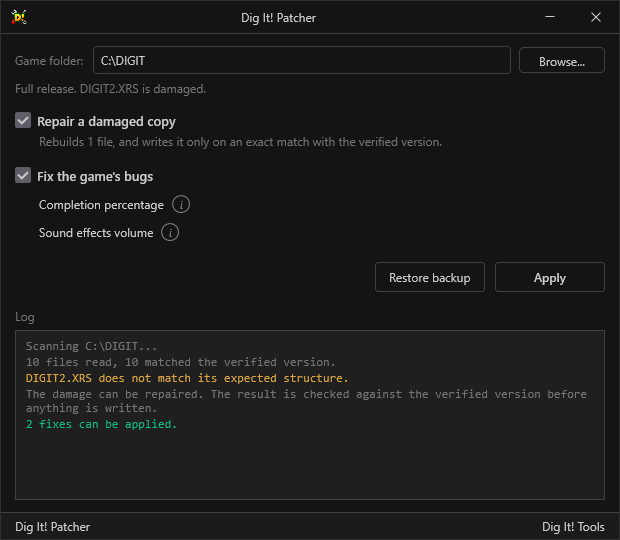
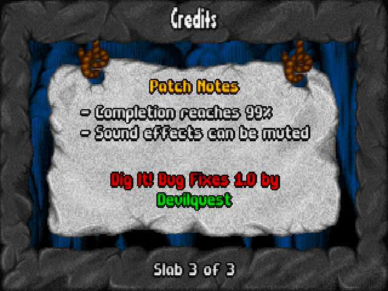
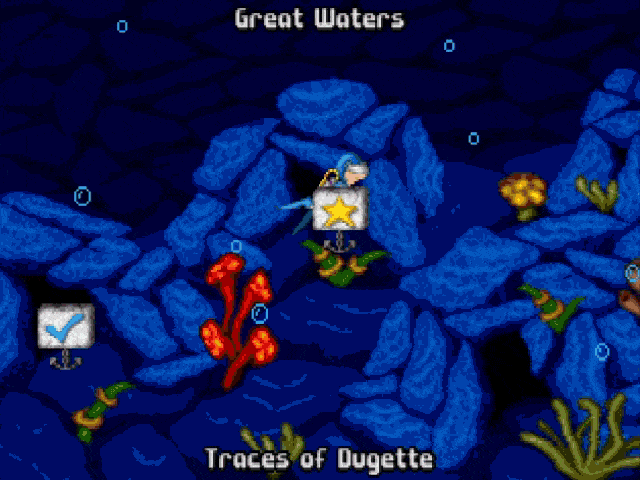

<div align="center">

# Dig It! Patcher

**Repairs a damaged copy of Dig It! and fixes bugs in the original version.**

[](#changelog)
[](LICENSE)
[](https://github.com/Devilquest/DigItPatcher/releases/latest)


**[Download Dig It! Patcher](https://github.com/Devilquest/DigItPatcher/releases/latest)**

</div>

---

## Table of Contents

### General Information
- [About the Project](#about-the-project)
- [Key Features](#key-features)
- [How It Works](#how-it-works)
- [Motivation](#motivation)

### Technical Deep Dive
- [Getting Started](#getting-started)
- [Known Bugs and Damage](#known-bugs-and-damage)
- [Architecture & Technologies](#architecture-and-technologies)
- [Roadmap](#roadmap)
- [Credits & Contact](#credits-and-contact)
- [Changelog](#changelog)
- [License](#license)
- [Donations](#donations)

---

## About the Project

Dig It! Patcher is a Windows desktop application that inspects and repairs an existing copy of **Dig It!** (Pixel Painters Corp., 1996), a 16-bit DOS platformer. It performs two distinct operations:

- **Archive Repair**: Certain commercial CD-ROM pressings and community distributions contain corrupted game archives that can cause crashes or corrupted graphics. When the damage consists of displaced data spans, the Patcher reconstructs the original archive structure algorithmically and validates the repaired result against verified retail release checksums.
- **Engine Bug Fixes**: Corrects two programming bugs identified in the original 1996 retail releases: a volume clamping defect that prevents sound effects from being muted, and a level-completion bitfield calculation error that caps game completion at 42%.

These operations are strictly separated. Users can repair archive integrity, apply executable fixes, or perform both operations. Archive repair does not modify the executable or apply any gameplay fixes.

*Dig It! © 1996 Pixel Painters Corp. This is an unofficial fan project, not affiliated with or endorsed by Pixel Painters Corp. or any publisher of the game. It redistributes no original game assets: it only modifies an existing copy of the game, always creating a full backup beforehand.*

<div align="center">
  
</div>

---

## Key Features

- **Release fingerprinting**: Computes SHA-256 checksums for each of the ten core game files and compares them against a database of known releases and distributions, including retail, Manaccom, shareware, and documented corrupted copies.
- **Algorithmic archive repair**: Reconstructs displaced byte spans in corrupted archives using internal image format boundary checks and validates the repaired files against the corresponding clean release checksums.
- **Original engine bug fixes**: Corrects the sound effects volume clamp in `DIGIT.EXE` and the world and substage completion bitfield calculation in `MAIN.EXE`, allowing the game to reach 99% completion.
- **Pre-write safety checks**: Verifies that expected original bytes are still present at the target offsets before modifying a file. If the file has been changed externally, the operation is aborted without writing.
- **Automated full backups**: Creates a complete backup under `DigItPatcher_Backup/` before modifying any file, including a detailed text log and a restore function.
- **Patch identification**: Applying the game bug fixes adds a patch screen to the game's Credits and a version identifier below the main menu copyright line. These markers are added automatically to distinguish patched versions from the original game.
- **Clean repair mode**: Repairs archive damage without adding patch information, producing files that are byte-identical to the corresponding original clean files.
- **Offline execution**: Operates entirely locally with no network connections, telemetry, or external configuration files.

---

## How It Works

1. **Select the game folder**: The application detects the game automatically if placed in the game folder; otherwise, select `Browse...`. Valid folders contain `.XRS` archives or a nested `DIGIT/` folder.
2. **Automated scan**: Identifies the specific game release by file hashes and checks whether the game bug fixes have already been applied.
3. **Review diagnostics**: The interface reports file integrity, identifies repairable damage, and displays the status of the available bug fixes.
4. **Select operations**: Choose whether to repair archive damage, apply the game bug fixes, or perform both. Archive repair is available only when repairable damage is detected.
5. **Apply changes**: Creates a backup and applies the selected operations. When bug fixes are applied, the corresponding patch information is also added to the game.
6. **Restore if needed**: Selecting `Restore Backup` overwrites the game folder with the original files from the backup directory.

### In-Game Patch Notices

Applying the game bug fixes adds a patch notes slab to the in-game Credits and a version identifier below the main menu copyright line. These markers distinguish patched versions from the original game.

<div align="center">
  
</div>

---

## Motivation

Historical CD-ROM pressings of Dig It! (such as magazine cover discs from early 1997) and later distributions of those releases contain damaged game data that can cause crashes when loading certain levels, notably `LVL280` in the Great Waters. Analysis revealed that this corruption originated from defects in `DIGIT2.XRS`: a single stray byte was inserted at offset `0x31F91C` and a single byte was dropped at `0x4B8FFF`, displacing 1.6 MB of data and corrupting 19 level files.

Extensive testing of the original game during the development of the Dig It! toolset also revealed two programming bugs present in the original retail releases: an inverted conditional jump that prevents sound effects from being muted, and a level-completion bitfield calculation defect that prevents players from exceeding 42% completion even after beating every stage. Further analysis of the game's DOS binaries identified the underlying causes of both bugs.

These findings led to Dig It! Patcher, which combines algorithmic repair of structurally damaged archives with fixes for the two original game bugs.

The project follows three principles:

- **Byte-level verification**: Binary patches are applied only after the expected bytes at their target offsets have been confirmed. Archive repairs are accepted only when the resulting file matches a known clean release hash.
- **Distinct operation contracts**: Archive repair restores corrupted files to match historical releases, while bug fixes modify the original executable to correct its behavior.
- **No asset redistribution**: The utility distributes no original game files, code, or artwork. In-game patch notes are composed locally from the user's existing game files.

---

## Technical Deep Dive

## Getting Started

### Prerequisites

- **Operating System**: Windows 10 or later.
- **Runtime**: [.NET 10 Desktop Runtime](https://dotnet.microsoft.com/download/dotnet/10.0) (required for standard and ZIP builds; not required for the standalone executable).
- **Game Files**: An existing copy of Dig It! in a writable folder.
- **Build Requirements**: [.NET 10 SDK](https://dotnet.microsoft.com/download/dotnet/10.0) (only required when building from source).

### Download and Run

Download packages are available on the [Releases](https://github.com/Devilquest/DigItPatcher/releases/latest) page:

| Package | Description |
| :--- | :--- |
| `DigItPatcher-Standalone.exe` | Self-contained single-file executable. Requires no pre-installed runtime. |
| `DigItPatcher.exe` | Lightweight single-file executable. Requires .NET 10 Desktop Runtime. |
| `DigItPatcher-win-x64.zip` | Portable archive with loose binaries. Requires .NET 10 Desktop Runtime. |

Because the executables are not signed with a commercial certificate, Windows SmartScreen may display a warning on first launch. Click **More info**, then **Run anyway**. SHA-256 checksums are provided on the Releases page to verify package integrity.

### Building From Source

1. **Clone the repository**:
   ```bash
   git clone https://github.com/Devilquest/DigItPatcher.git
   cd DigItPatcher
   ```
2. **Build and run**:
   ```bash
   dotnet build
   dotnet run --project DigItPatcher.App
   ```
3. **Run unit tests**:
   ```bash
   dotnet test
   ```

### Troubleshooting

- **"This folder does not hold a copy of the game"**: The application searches for `.XRS` archives in the selected folder and immediately within a nested `DIGIT/` subfolder.
- **"Could not be opened for writing"**: Ensure the game directory is writable and that the files are not locked by another application.
- **Fix status displays "Unexpected bytes"**: The bytes at the target executable offsets do not match the expected values for that fix. The executable may have been modified or may not match a supported clean release.
- **Fix status displays "Not available for this release"**: The fix has not been mapped for this specific game release or compilation, such as shareware builds with different code offsets.
- **"Repair search budget exceeded"**: The repair algorithm stops after 5,000 candidate evaluations without finding a result that matches a known clean release hash. No changes are made to the affected files.

---

## Known Bugs and Damage

The following table summarizes known bugs in the original game and historical cases of media damage:

| Defect | Patcher Action | Classification | Root Cause |
| :--- | :--- | :--- | :--- |
| [Sound Effects Set to Off Play at Full Volume](#sound-effects-set-to-off-play-at-full-volume) | **Fixed** | Original game bug | Conditional jump folds zeroed volume into maximum clamp |
| [The Completion Percentage Stops at 42%](#the-completion-percentage-stops-at-42) | **Fixed** | Original game bug | Routine omits world index and aliases substages modulo 5 |
| [Music Set to Off Is Still Faintly Audible](#music-set-to-off-is-still-faintly-audible) | **Untouched** | Engine design | Driver attenuation scale lacks a hardware silence value |
| [The Displaced Span in `DIGIT2.XRS`](#the-displaced-span-in-digit2xrs) | **Repaired** | Damaged media | Single byte inserted and single byte dropped, displacing 1.6 MB |
| [Lost sectors in `DIGIT1.XRS`](#unrepairable-media-corruption) | **Not repairable** | Damaged media | 24 KB of physical disc sectors replaced by noise |
| [Duplicated sectors in shareware `DIGIT0.XRS`](#unrepairable-media-corruption) | **Not repairable** | Damaged media | 34 KB of physical disc sectors overwritten by adjacent sectors |

All memory and file locations represent hexadecimal byte offsets within the respective game binaries.

### Sound Effects Set to Off Play at Full Volume

**Symptom**: Setting the sound effects volume to `Off` in the Setup menu causes sound effects to play at full volume (`Max`). Intermediate volume settings (1 through 9) attenuate sound normally.

**Data Flow**: The Setup screen stores audio settings in the 14-byte header of `DIGIT.CFG`. The sound effects volume is a 16-bit word at offset `+0x08` (values 0 to 10). During startup and menu adjustments, `MAIN.EXE` transfers this value to the sound driver in `DIGIT.EXE` via real-mode interrupt `INT 81h` (`SI = 0x15`, volume in `AX`).

**Defect Analysis**: `DIGIT.EXE` first maps the 0–10 UI range onto an internal 1–256 scale:

```c
sfx = (uiSfx << 8) / 10;
if (sfx > 256) sfx = 256;
if (sfx < 1)   sfx = 1;        // Off (0) is clamped to 1
```

The driver then scales this value to the software mixer's 0–32 domain:

```assembly
AX >>= 3                      ; 1..256 -> 0..32
if (AX == 0) goto clampMax    ; Defect at DIGIT.EXE offset 0x2C64
if (AX <= 0x20) goto store
clampMax: AX = 0x20           ; 32, full volume
store: [0x4262] = AX
```

When `uiSfx` is 0 (`Off`), it clamps to 1; right-shifting 1 by 3 bits yields 0. The conditional jump at `0x2C64` tests for 0 and jumps directly to `clampMax`, storing 32 (full scale). Settings 1 through 10 produce non-zero shifted values and are stored correctly.

`[0x4262]` scales the mixer's volume lookup tables:

$$\text{table}_n[s] = \text{high byte of } (\text{int8})s \times (n+1) \times \texttt{[0x4262]}$$

A stored value of 0 zeroes the lookup tables, producing true silence.

**The Fix**: Replace the 2-byte conditional jump with two `NOP` instructions:

| Binary Offset (`DIGIT.EXE` `0x2C64`) | Original Bytes | Patched Bytes |
| :--- | :--- | :--- |
| Jump instruction | `74 05` (`jz clampMax`) | `90 90` (`nop; nop`) |

With this patch, `AX = 0` falls through to the storage routine, zeroing the mixer tables and muting sound effects completely without audio clicks.

### The Completion Percentage Stops at 42%

**Symptom**: Completing all regular levels, secret substages, and defeating the final boss results in a displayed completion percentage of only 42%.

**Calculation Formula**:

$$\text{displayed \%} = \left\lfloor \frac{\text{popcount(completion bitfield)} \times 100}{\text{total levels}} \right\rfloor$$

- **Completion bitfield**: 160 bytes at the end of the saved game state, treated as 80 16-bit words where the lower 11 bits are flags (one bit per level).
- **Total levels**: Probed at startup from `LVL000.DLF` through `LVL799.DLF`, totaling **125** in the full release.

**Defect Analysis**: On level completion, `MAIN.EXE` records completion status using this calculation:

```c
word[ current_world_node ] |= 1 << (substage % 5);
```

This implementation contains two logical errors:

1. **Omission of world index**: All four worlds share the same 16-word array. Completing a level in World 1 overwrites the bit for the corresponding node in Worlds 2, 3, and 4.
2. **Modulo 5 substage divisor**: Levels contain up to ten substages (0–9). Using modulo 5 causes substages 5–9 to collide with substages 0–4.

Due to these collisions, only **53 of the 125 total cells** can ever be set in the bitfield:

$$\left\lfloor \frac{53 \times 100}{125} \right\rfloor = \left\lfloor 42.4 \right\rfloor = 42\%$$

**The Fix**: Replace 39 bytes at `MAIN.EXE` offset `0x1893B` with 38 instructions and one `NOP`:

| Implementation | Word Calculation | Bit Calculation | Maximum Ceiling |
| :--- | :--- | :--- | :--- |
| **Original** | `node` | `substage % 5` | 42% (53 / 125) |
| **Patched** | `(world * 16) + node` | `substage % 10` | 99% (124 / 125) |

This allocates 16 words per world and removes substage aliasing, allowing all 124 standard levels to register correctly.

### The 99% Completion Ceiling

A fully completed game reaches 99% rather than 100% because defeating the final boss triggers an immediate cinematic exit code (`0x32`), which branches past the level completion bitfield updater. Since the game returns to the main menu after the ending sequence and the final boss completion is not saved, the last saved state remains at 99%.

### Music Set to Off Is Still Faintly Audible

**Status**: Preserved as original engine behavior.

Setting the music volume to `Off` sets the internal volume variable to 1, causing the OPL2 FM driver to set carrier attenuation to maximum (TL 63, approximately -47.25 dB). The engine does not key off active voices. True muting would require halting sequencer execution, which alters runtime engine behavior rather than correcting a defect.

### The Displaced Span in DIGIT2.XRS

**Symptom**: Entering level `LVL280` in the Great Waters world triggers `Runtime error 216 at 0002:3724`.

<div align="center">
  
</div>

**Root Cause**: A mastering defect inserted a stray byte `0xF4` at offset `0x31F91C` and dropped a byte `0x2B` at offset `0x4B8FFF`. The intervening 1,638,177 bytes are shifted by one position, corrupting 19 `.MPF` image entries across two world nodes.

**Algorithmic Recovery**:
Image entries in `.XRS` archives follow strict internal invariants:

1. Frame chains must traverse exactly `extra_frames + 1` entries to the declared length.
2. Decompressed frames must expand to exactly 64,000 bytes.

The Patcher evaluates these structural boundaries to bracket the insertion and missing-byte positions:

1. Identifies the first failing entry to bracket the candidate insertion range.
2. Identifies the final failing entry to bracket the candidate missing-byte range.
3. Tests candidate corrections and validates the resulting archive against the verified clean retail SHA-256 hash.

Realigning the displaced span restores all 19 entries and reproduces the original retail file byte-for-byte.

### Unrepairable Media Corruption

Certain CD-ROM distributions of the game contain corrupted data:

- **`DIGIT1.XRS` Lost Sectors**: 24 KB of physical CD sectors replaced by noise.
- **`DIGIT0.XRS` Shareware Duplicate Sectors**: 34 KB of CD sectors overwritten by copies of adjacent sectors.

Because the original data is destroyed and not present elsewhere in the file, these archives cannot be reconstructed algorithmically. Dig It! Patcher detects and reports these conditions clearly without altering the files.

---

## Architecture & Technologies <a id="architecture-and-technologies"></a>

### Tech Stack

| Component | Technology | Purpose |
| :--- | :--- | :--- |
| **Runtime** | .NET 10 | Application runtime |
| **UI Shell** | WPF (`net10.0-windows`) | Desktop user interface |
| **MVVM** | CommunityToolkit.Mvvm | Observable models and command bindings |
| **UI Controls** | HandyControl | Control styling and components |
| **Testing** | xUnit | Automated test suite |

### Core Separation

`DigItPatcher.Core` contains zero UI dependencies. File inspection, checksum verification, archive reconstruction, and binary patching are implemented entirely in the Core layer.

```text
.
├── DigItPatcher.Core/           Repair algorithms, binary fixes, backup management
│   ├── Content/                 Embedded release list and per-fix explanation text
│   ├── Fixes/                   IFix interface and binary patch definitions
│   ├── Formats/                 .XRS archive parser, NE segment table, and frame codecs
│   ├── Install/                 File hashing, backup management, and release catalog
│   ├── MenuLine/                Main menu version-line compositor
│   ├── Patching/                Diagnostic scanner, repair runner, verification
│   ├── Repairs/                 IRepair interface and displaced span algorithm
│   ├── Slab/                    Credits patch-notes slab compositor
│   └── Text/                    Patch version text formatter
├── DigItPatcher.App/            WPF desktop interface
│   ├── Assets/                  Application icon
│   ├── Interop/                 DWM interop for dark title bar
│   ├── Theme/                   Application styling shared with Dig It! Explorer
│   ├── ViewModels/              Diagnostic lists and operation bindings
│   └── Views/                   Main window, About dialog, and Tools dialog
└── DigItPatcher.Tests/          Unit and integration tests
```

### Safety and Execution Model

- **Pre-write backup**: Before any write operation, all files scheduled for modification are backed up to `DigItPatcher_Backup/`.
- **Pre-write verification**: Binary patches check expected original bytes at target offsets before writing.
- **Strict repair validation**: Archive repairs are saved only when the reconstructed file matches the verified clean SHA-256 checksum.
- **Execution ordering**: Archive repairs are applied first, followed by executable bug fixes and patch identification markers.

---

## Roadmap

Version 1.0.0 provides complete support for release identification, archive repair, executable patching, automated backups, and in-game patch identification.

Future roadmap considerations:

- [ ] **Gameplay modifications**: Support for non-standard gameplay modifications, separate from historical bug fixes.

---

## Credits & Contact <a id="credits-and-contact"></a>

### Authors
- **Devilquest** - *Lead Developer* - [@devilquest](https://github.com/devilquest)

### Acknowledgments
- **Pixel Painters Corp.** for Dig It! (1996).
- **Frenkel Smeijers**, author of [PPExt](https://sfprod.shikadi.net/), whose research into Pixel Painters archive formats enabled resource reconstruction.
- **DOSBox project** for 16-bit DOS runtime testing and verification.

### Dig It! Toolset
- **[Dig It! Explorer](https://github.com/Devilquest/DigItExplorer)**: Browses and reconstructs Dig It! levels, animations, screens, and audio from a local copy with no emulator.
- **[Dig It! Atlas](https://github.com/Devilquest/DigItAtlas)**: Maps every Dig It! level in the browser, with layers, entity positions, and interactive navigation.

---

## Changelog

### [1.0.0]
- **Added**: Initial release.
  - SHA-256 release identification across ten core game files.
  - Repair for `DIGIT2.XRS` displaced byte span damage.
  - Bug fix for the sound effects volume mute defect in `DIGIT.EXE`.
  - Bug fix for the 42% completion ceiling defect in `MAIN.EXE`.
  - Automated full backup and restoration.
  - In-game patch notes slab on the Credits and a version identifier below the main menu copyright line.
  - Diagnostic reporting for non-repairable archive damage.

---

## License

This project is licensed under the [MIT License](LICENSE).

Copyright (c) 2026 Devilquest.

---

## Donations
**Donations are always greatly appreciated. Thank you for your support!**

<div align="center">
<a href="https://www.buymeacoffee.com/devilquest" target="_blank"></a>
</div>
